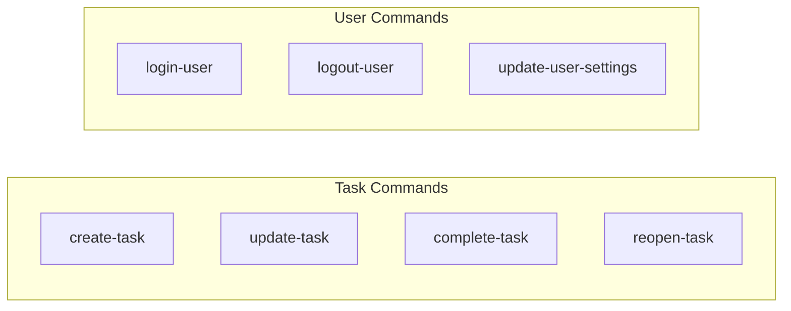

# Domain Command Catalog

This catalog lists all domain commands accepted by the system along with their expected payload structures.

| Command | Description | Payload Structure |
|---------|-------------|------------------|
| `create-task` | Create a new task. | `{ "title": string, "notes"?: string, "category"?: string, "order"?: number }` |
| `update-task` | Modify task fields. | `{ "id": string, "title"?: string, "notes"?: string, "category"?: string, "order"?: number, "done"?: boolean }` |
| `complete-task` | Mark a task as completed. | `{ "id": string }` |
| `reopen-task` | Reopen a completed task. | `{ "id": string }` |
| `login-user` | Log a user in, creating the user if they do not exist. | `{ "name": string, "email": string }` |
| `logout-user` | Log a user out. | _No payload_ |
| `update-user-settings` | Change user settings. | `{ "tasksPerCategory"?: number, "showDoneTasks"?: boolean }` |

## Task ordering semantics

Tasks within the same category are ordered using the zero-based `order` attribute. The frontend now exposes explicit "move up"
and "move down" controls on each task card. Activating either control generates two `update-task` commands: one for the
selected task and one for the adjacent task that swaps places. Each command updates only the `order` field, which keeps the
ordering logic isolated and idempotent.

Dragging a task between categories issues a single `update-task` command that changes the `category` and assigns an `order`
value equal to the number of existing tasks in the target category. This guarantees that the moved task is appended to the end
of the destination category while keeping intra-category drag and drop disabled.
