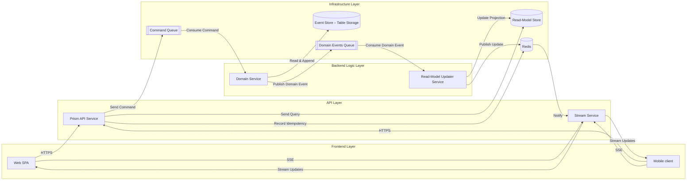

# Event‑Sourced Micro‑services Design

> **Goal:** clean separation between *command handling*, *domain validation*, and *read‑side projections* while keeping the API thin and front‑end‑friendly.

---

## Architecture at a Glance

---

## Layer Responsibilities

| Layer              | Component(s)                                 | Key Duties |
| ------------------ | ---------------------------------------------| ----------------------------------------------------------------------------------------------------------------------------------------------------------------------------------------------------------------------- |
| **Frontend**       | *Web SPA* *Mobile client*                 | Calls REST/GraphQL endpoints to query data and invoke commands. |
| **API**            | *Prism API Service* *Stream Service*      | • **Prism API Service** converts HTTP requests to **commands**, reads projections from *Read‑Model Store*, publishes commands to *Command Queue*. No business rules beyond basic DTO validation. • **Stream Service** streams read‑model changes to clients using server‑sent events. |
| **Backend Logic**  | *Domain Service* *Read‑Model Updater*     | • **Domain Service** pulls commands, re‑hydrates aggregates from the *Event Store*, validates invariants / idempotency, appends events, then emits them to *Domain Events Queue*. • **Read‑Model Updater** listens to domain events and updates denormalised read tables. |
| **Infrastructure** | Queues / Stores                              | • **Command Queue**: decouples request rate from domain processing. • **Event Store**: immutable append‑only log per aggregate. • **Domain Events Queue**: fan‑out bus for projections or other integrations. • **Read‑Model Store**: query‑optimised tables / documents. |

---

## Execution Flow

1. **Command path**
    - Frontend sends an intent (e.g., *AddItemToCart*) → API publishes command to **Command Queue**.
    - **Domain Service** consumes the command, loads the aggregate’s past events from **Event Store**, executes business logic, then writes new events back to the store.
    - Same service publishes those events to **Domain Events Queue**.
2. **Read‑side update**
   **Read‑Model Updater** consumes the event stream, materialises projections in **Read‑Model Store**.
3. **Query path**
   API reads the projection tables (no joins/logic) and returns view‑models to the SPA.

---

## Why Two Queues?

| Queue                   | Purpose                                                                   | Failure Isolation                                                                |
| ----------------------- | ------------------------------------------------------------------------- | -------------------------------------------------------------------------------- |
| **Command Queue**       | Buffer bursty write traffic and provide retry logic for command handling. | Slow command processing does **not** block read‑model refresh.                   |
| **Domain Events Queue** | Distribute validated events to any number of projections/integrations.    | A bad projection consumer can be paused without stopping core domain processing. |

---

## Operational Notes

* **Idempotency**: Prism API stores command idempotency keys in Redis to drop duplicates across instances. Domain Service keeps a *processed‑command* hash per aggregate to drop duplicates.
* **Schema evolution**: version events, keep up‑casters in Domain Service; read‑models are rebuildable.
* **Local Dev**: run Azure Storage emulator in Docker (`Azurite`) for queues and table storage.
* **Observability**: correlate `commandId` ↔ `eventId` across logs for easy tracing.

---

## When to Scale Out

* Heavy write load → add more Domain Service replicas (they compete on the Command Queue).
* Multiple read models (search, analytics) → fan additional consumers off Domain Events Queue.

---
