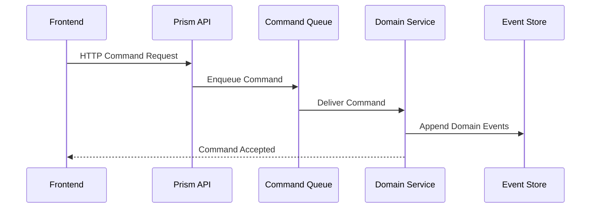
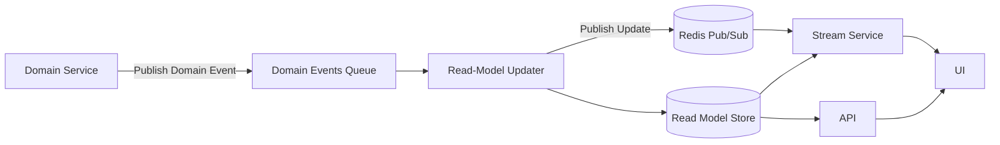

# Application Event Flow

This document illustrates how application events travel through the system and how they are handled.

## Command Handling

```mermaid
sequenceDiagram
    participant UI as Frontend
    participant API as Prism API
    participant CQ as Command Queue
    participant DS as Domain Service
    participant ES as Event Store

    UI->>API: HTTP Command Request
    API->>CQ: Enqueue Command
    CQ->>DS: Deliver Command
    DS->>ES: Append Domain Events
    DS-->>UI: Command Accepted
```

## Projection Updates

```mermaid
flowchart LR
    DS[Domain Service] -->|Publish Domain Event| DEQ[Domain Events Queue]
    DEQ --> RMU[Read-Model Updater]
    RMU --> RM[(Read Model Store)]
    RMU -->|Publish Update| REDIS[(Redis Pub/Sub)]
    REDIS --> SS[Stream Service]
    RM --> API
    RM --> SS
    SS --> UI
    API --> UI
```
