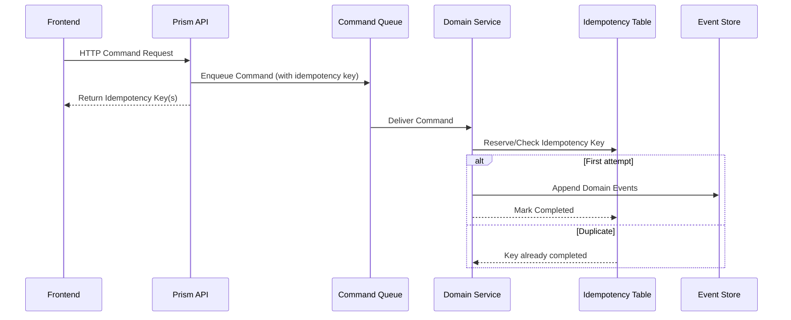
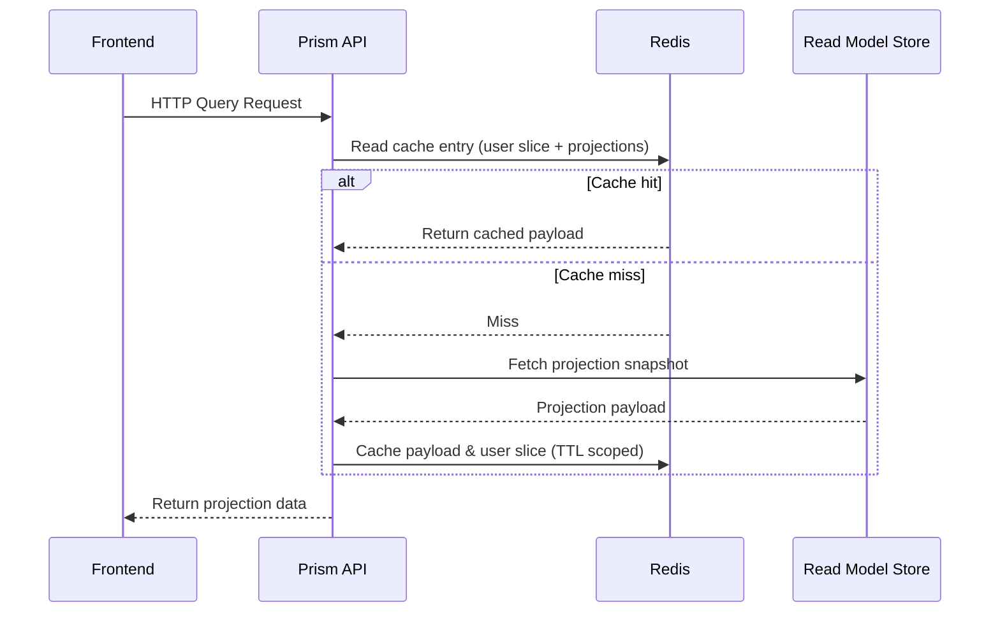
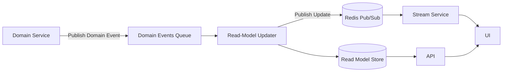

# Application Event Flow

This document illustrates how application events travel through the system and how they are handled.

## Command Handling

The domain service keeps idempotency keys inside the Azure Table that backs the task and user event stores. Each command run reuses the key provided by the Prism API; if the table already records the key as completed, the handler simply skips emitting duplicate events.

## Query Handling

Prism API queries Redis before touching the read-model store. Cache hits now satisfy requests entirely from Redis, cutting down on
database round trips. When a miss occurs, the API reads the projection once, stores a small slice of user data alongside the
projection payload, and serves the response. Subsequent requests reuse the cached snapshot until the TTL expires or a projection
update invalidates the entry.

## Projection Updates

## Command Catalog

For a complete list of domain commands and their payload structures, see [commands.md](./commands.md).

## Event Catalog

For a complete list of domain events and their payload structures, see [events.md](./events.md).
