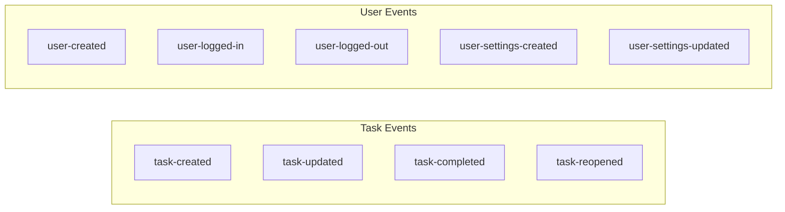

# Domain Event Catalog

This catalog lists all domain events emitted within the system along with their payload structures.

| Event | Description | Payload Structure |
|-------|-------------|------------------|
| `task-created` | New task is created. | `{ "title": string, "notes": string, "category": string, "order": number }` |
| `task-updated` | Task fields are updated. | `{ "title"?: string, "notes"?: string, "category"?: string, "order"?: number, "done"?: boolean }` |
| `task-completed` | Task marked as completed. | _No payload_ |
| `task-reopened` | Completed task reopened. | _No payload_ |
| `user-created` | New user registered. | `{ "name": string, "email": string }` |
| `user-logged-in` | User logged in. | _No payload_ |
| `user-logged-out` | User logged out. | _No payload_ |
| `user-settings-created` | Initial settings created for user. | `{ "tasksPerCategory": number, "showDoneTasks": boolean }` |
| `user-settings-updated` | User changed their settings. | `{ "tasksPerCategory"?: number, "showDoneTasks"?: boolean }` |

## Event storage schema

Task and user events are stored in dedicated Azure Table Storage tables. Each row represents a single event with the following layout:

| Column | Description |
| --- | --- |
| `PartitionKey` | Entity identifier (task ID or user ID). |
| `RowKey` | Event identifier. |
| `Type` | Event type (`Edm.String`). |
| `EventTimestamp` | Event timestamp represented as a 64-bit integer (`Edm.Int64`). |
| `UserId` | Identifier of the actor that produced the event (`Edm.String`). |
| `IdempotencyKey` | Command idempotency key (`Edm.String`). |
| `Data` | JSON payload that contains only domain-specific fields. Metadata fields such as `Id`, `EntityId`, `EntityType`, and `IdempotencyKey` are not duplicated here (`Edm.String`). |

All persisted string and integer columns include explicit `@odata.type` annotations so downstream services can rely on consistent typing when reading the tables.

### Task ordering updates

Reordering uses `task-updated` events that include only the `order` field for the affected tasks. When a task is moved to
another category, the emitted `task-updated` event carries both the new `category` and an `order` value equal to the number of
tasks that existed in the destination category prior to the move. This ensures downstream consumers append the task instead of
reordering existing items.

