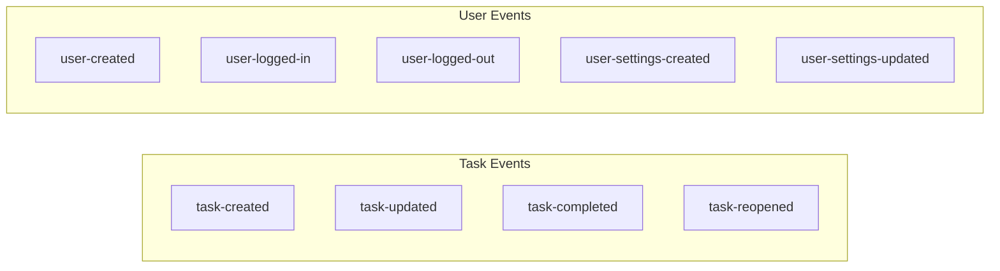

# Domain Event Catalog

This catalog lists all domain events emitted within the system along with their payload structures.

| Event | Description | Payload Structure |
|-------|-------------|------------------|
| `task-created` | New task is created. | `{ "title": string, "notes": string, "category": string, "order": number }` |
| `task-updated` | Task fields are updated. | `{ "title"?: string, "notes"?: string, "category"?: string, "order"?: number, "done"?: boolean }` |
| `task-completed` | Task marked as completed. | _No payload_ |
| `task-reopened` | Completed task reopened. | _No payload_ |
| `user-created` | New user registered. | `{ "name": string, "email": string }` |
| `user-logged-in` | User logged in. | _No payload_ |
| `user-logged-out` | User logged out. | _No payload_ |
| `user-settings-created` | Initial settings created for user. | `{ "tasksPerCategory": number, "showDoneTasks": boolean }` |
| `user-settings-updated` | User changed their settings. | `{ "tasksPerCategory"?: number, "showDoneTasks"?: boolean }` |

